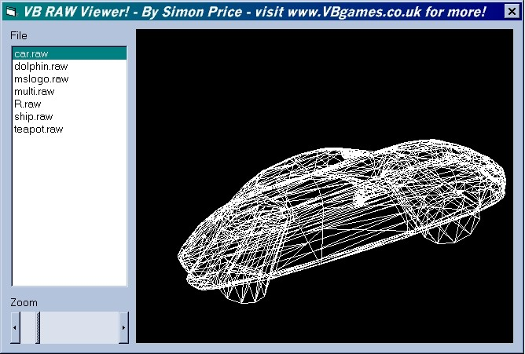



## VB \.raw file viewer\! \*\*\* 100% VB code \*\*\*

### Description

Load and view .raw files! These 3D data files (supported by most 3D modelling programs) only contain a list of triangles, and so this program reads the files and renders a spinning wireframe model from them. As proof of VB power, I decided to make the program using VB code only (no DirectX or OpenGL, just 100% VB!). The program employs the use of the Windows API and look up tables to increase speed, and double buffering to increase smoothness. It renders about 50000 polys/sec so it can load medium size files and render them at a fair frame rate. Look how short the source code is compared to the results! Please vote/give feedback because I spent several hours getting this to work well! *** IMPORTANT NOTE *** Only run this program from the compiled .exe, if you run it from VB (in my experience, it may not happen to you), the program does not render all the polygons!
 
### More Info
 

             |
---                |---
**Submitted On**   |2000-11-15 20:45:24
**By**             |[Simon Price](https://github.com/Planet-Source-Code/PSCIndex/blob/master/ByAuthor/simon-price.md)
**Level**          |Intermediate
**User Rating**    |4.4 (31 globes from 7 users)
**Compatibility**  |VB 6\.0
**Category**       |[Graphics](https://github.com/Planet-Source-Code/PSCIndex/blob/master/ByCategory/graphics__1-46.md)
**World**          |[Visual Basic](https://github.com/Planet-Source-Code/PSCIndex/blob/master/ByWorld/visual-basic.md)
**Archive File**   |[CODE\_UPLOAD1171311152000\.zip](https://github.com/Planet-Source-Code/simon-price-vb-raw-file-viewer-100-vb-code__1-12816/archive/master.zip)

